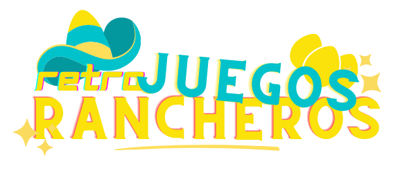

# RETRO JUEGOS RANCHEROS
A place to play and enjoy a variety of classic games

**Link to project:** https://juegos-rancheros.herokuapp.com/

## How It's Made:

**Tech used:** HTML, CSS, JavaScript, Node.js

Here's where you can go to town on how you actually built this thing. Write as much as you can here, it's totally fine if it's not too much just make sure you write *something*. If you don't have too much experience on your resume working on the front end that's totally fine. This is where you can really show off your passion and make up for that ten fold.

## Optimizations

Did you write something then refactor it later and the result was 5x faster than the original implementation? Did you cache your assets? Things that you write in this section are **GREAT** to bring up in interviews and you can use this section as reference when studying for technical interviews!

## Lessons Learned:

No matter what your experience level, being an engineer means continuously learning. Every time you build something you always have those *whoa this is awesome* or *fuck yeah I did it!* moments. This is where you should share those moments! Recruiters and interviewers love to see that you're self-aware and passionate about growing.

## Contributors:
The International Team of Engineers:

**Adil Tahiri** https://github.com/adilth

**Dion Wilson** https://github.com/dionwdev

**Fernando De La Torre** https://github.com/ferndiddy

**Kathleen D Wims** https://github.com/bewimsical

**Leonidas Gkimisis** https://github.com/Greek4Tech

**Sigrid van der Walt** https://github.com/Eagle747

